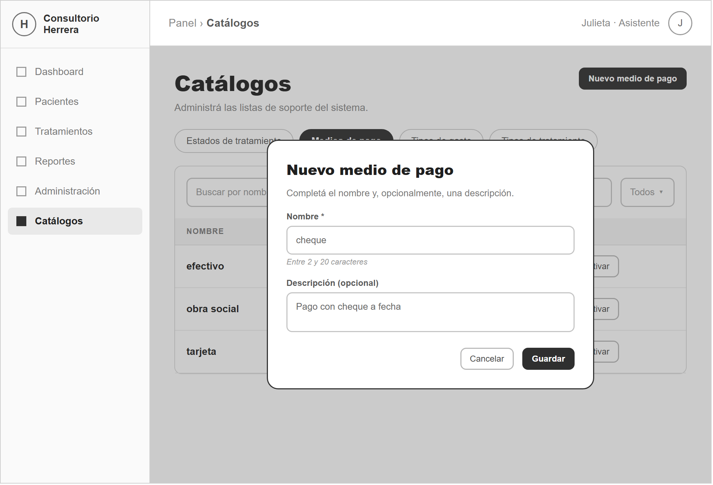
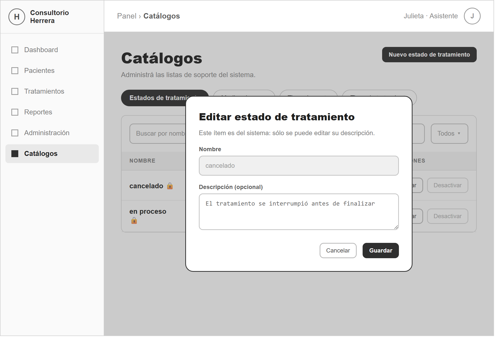
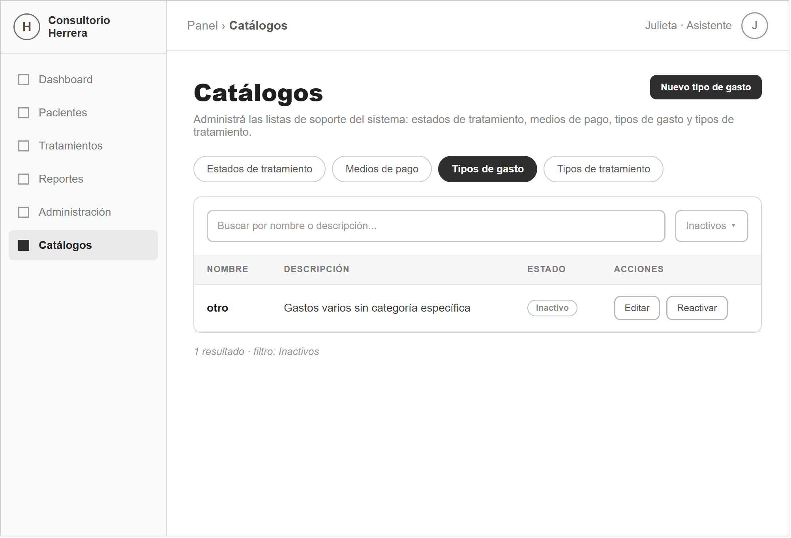
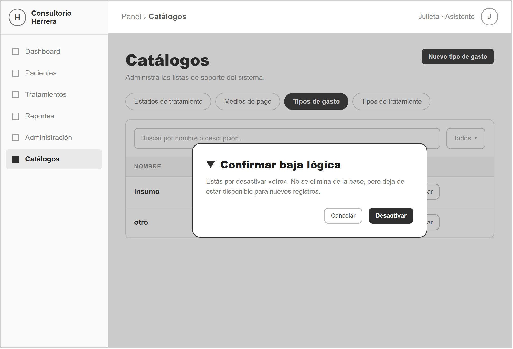

# SprintLog — ABM 01 · Catálogos de soporte

> Sprint documental: **3.1** · Historias: **HU-01 … HU-04** (numeración reiniciada por ABM).
> Documento formal: [`SprintLog-Catalogos.docx`](SprintLog-Catalogos.docx) (formato calcado de `docs/abm/modelo/com.docx`).
> Mockups: [`mockups/`](mockups/) (wireframes HTML + PNG en escala de grises).

---

## Objetivo del Sprint

Implementar el ABM de los cuatro catálogos de soporte del sistema del consultorio
odontológico Herrera —**estados de tratamiento, medios de pago, tipos de gasto y
tipos de tratamiento**— en un único módulo (`catalogos`), con endpoints
parametrizados por catálogo y un solo par de permisos (`ver_catalogos`,
`gestionar_catalogos`).

Son listas de baja cardinalidad que parametrizan el dominio: cada tratamiento,
pago y gasto de los sprints siguientes referencia un ítem de estos catálogos. No
son entidades transaccionales (no hay evento de negocio ni ciclo de estados), por
eso el documento no lleva secciones de transiciones ni de auditoría.

Tres de las cuatro tablas no tenían baja lógica; este sprint agrega la columna
`activo` de forma **aditiva** (`ALTER TABLE ... ADD COLUMN`), sin recrear ni
renombrar nada. Primer ABM del proyecto: crea también el directorio `database/`.

---

## Sprint Backlog

| Nro | Historia de Usuario | Prioridad | Estimación | Dependencias |
|---|---|---|---|---|
| HU-01 | Como administrador del consultorio quiero dar de alta un ítem en cualquiera de los cuatro catálogos, indicando su nombre y una descripción opcional, para poder usarlo al registrar tratamientos, pagos o gastos. | Alta | S | Ninguna |
| HU-02 | Como administrador del consultorio quiero modificar el nombre y la descripción de un ítem de catálogo para corregir la información cuando la carga inicial fue incompleta o errónea. | Alta | S | HU-01 |
| HU-03 | Como usuario del sistema quiero consultar el listado de cada catálogo, cambiando de catálogo por pestañas y filtrando por estado y por texto, para encontrar rápidamente el ítem que necesito. | Alta | S | HU-01 |
| HU-04 | Como administrador del consultorio quiero desactivar y reactivar ítems de catálogo, con las protecciones del caso, para retirar de circulación los que ya no se usan sin perder el historial. | Alta | S | HU-01, HU-03 |

---

## HU-01 – Alta de ítem de catálogo

**Como** administrador del consultorio
**quiero** dar de alta un ítem en cualquiera de los cuatro catálogos, indicando su nombre y, opcionalmente, una descripción,
**para** poder seleccionarlo al registrar tratamientos, pagos o gastos.

### Criterios de aceptación

- **Criterio 1 — Alta correcta.** Dado el formulario «Nuevo medio de pago»; cuando se ingresa el nombre `cheque` y se guarda; entonces se muestra «Se creó el medio de pago «cheque».» y el ítem aparece en el listado en estado Activo.
- **Criterio 2 — Validación de campos.** Dado un nombre vacío, de menos de 2 caracteres o mayor al máximo del catálogo (20; 50 en tipos de tratamiento); cuando se intenta guardar; entonces se muestran errores por campo y el ítem no se crea (HTTP 400).
- **Criterio 3 — Unicidad por catálogo.** Dado un medio de pago activo `efectivo`; cuando se intenta crear otro `EFECTIVO`; entonces HTTP 409 «Ya existe un medio de pago activo con ese nombre.».

*Figura 1 – Prototipo de la pantalla «Nuevo medio de pago» (HU-01)*

### Subtareas técnicas

| Subtarea | Descripción | Tamaño |
|---|---|---|
| `database/migrations/001_catalogos_activo.sql` | `ALTER TABLE` aditivo: `activo` + `descripcion` en `estados_tratamiento`, `medios_pago`, `tipos_gasto`. | XS |
| `database/migrations/002_permisos_catalogos.sql` | Alta de `ver_catalogos` / `gestionar_catalogos` y asignación al rol administrador. | XS |
| `catalogos.service` — mapa `CATALOGOS` + `crearItemDeCatalogo` | Traducción slug→tabla/columna, normalización, longitud por catálogo, unicidad case-insensitive entre activos. | M |
| `catalogos.validator` — `validarDatosItem` | Middleware que arma el array de errores por campo. | S |
| Ruta `POST /api/catalogos/:catalogo` | `verificarToken` + `verificarPermiso('gestionar_catalogos')`. | S |
| Frontend — `FormularioItemCatalogo.jsx` | Modal de alta. | M |
| Pruebas | Los 3 criterios vía API y en pantalla. | S |
| | **Total** | **S** |

---

## HU-02 – Modificación de ítem de catálogo

**Como** administrador del consultorio
**quiero** modificar el nombre y la descripción de un ítem de catálogo,
**para** mantener la información vigente cuando la carga inicial fue incompleta o errónea.

### Criterios de aceptación

- **Criterio 1 — Modificación permitida.** Dado el tipo de gasto `otro`; cuando se cambia su descripción y se guarda; entonces se muestra confirmación y el nuevo valor se refleja en el listado.
- **Criterio 2 — Ítem protegido, nombre bloqueado.** Dado el estado `cancelado` (uno de los estados base 1–4); cuando se abre su edición; entonces el campo Nombre está deshabilitado y sólo se guarda la descripción (HTTP 409 si se fuerza el renombre).
- **Criterio 3 — Unicidad al renombrar.** Dado un medio de pago activo `tarjeta`; cuando se intenta renombrar otro ítem activo como `Tarjeta`; entonces HTTP 409 y el cambio no se aplica.

*Figura 2 – Prototipo de la pantalla «Editar estado de tratamiento» (ítem protegido) (HU-02)*

### Subtareas técnicas

| Subtarea | Descripción | Tamaño |
|---|---|---|
| `catalogos.service` — `modificarItemDeCatalogo` | Existencia, unicidad al cambiar el nombre, bloqueo de renombre para protegidos (ids 1–4 de `estados_tratamiento`). | M |
| Ruta `PUT /api/catalogos/:catalogo/:id` | Permiso `gestionar_catalogos`; valida el id. | S |
| Frontend — modo edición del formulario | Precarga de datos; nombre deshabilitado en protegidos. | S |
| Manejo de errores por campo | El modal muestra la lista de `errores` del backend. | S |
| Pruebas | Edición normal, bloqueo de nombre, 409 por duplicado. | S |
| | **Total** | **S** |

---

## HU-03 – Consulta de catálogos con filtros

**Como** usuario del sistema
**quiero** consultar el listado de cada catálogo, cambiando de catálogo por pestañas, filtrando por estado y buscando por texto,
**para** encontrar rápidamente el ítem que necesito consultar.

### Criterios de aceptación

- **Criterio 1 — Filtro por catálogo y estado.** Dado el listado; cuando se selecciona la pestaña «Tipos de gasto» y el filtro «Inactivos»; entonces se muestran sólo los tipos de gasto dados de baja.
- **Criterio 2 — Sin resultados.** Dado que la búsqueda por texto no coincide con nada; cuando se escribe el texto; entonces se muestra «No se encontraron ítems con los filtros seleccionados.».
- **Criterio 3 — Acceso de sólo lectura.** Dado un usuario con `ver_catalogos` pero sin `gestionar_catalogos`; cuando abre la pantalla; entonces ve los listados pero los botones de acción están deshabilitados y el backend responde 403 a `POST`/`PUT`/`PATCH`.

*Figura 3 – Prototipo de la pantalla «Catálogos» — listado, pestañas y filtros (HU-03)*

### Subtareas técnicas

| Subtarea | Descripción | Tamaño |
|---|---|---|
| `catalogos.service` — `listarItemsDeCatalogo` | Filtro por estado, orden por nombre, marca `protegido`. | M |
| Ruta `GET /api/catalogos/:catalogo` | Permiso `ver_catalogos`; valida slug (404) y `?estado` (400). | S |
| Frontend — `PaginaCatalogos.jsx` | Pestaña por catálogo, filtro de estado contra el backend, búsqueda en cliente. | M |
| Frontend — `TablaCatalogo.jsx` | Tabla genérica, chip de estado, candado en protegidos, botones según permiso. | S |
| Ruta + menú lateral | `/panel/administrador/catalogos` + ítem «Catálogos». | XS |
| Pruebas | Filtros, aislamiento de permiso, «Sin resultados». | S |
| | **Total** | **S** |

---

## HU-04 – Baja lógica y reactivación de ítem de catálogo

**Como** administrador del consultorio
**quiero** desactivar un ítem de catálogo y poder reactivarlo,
**para** retirar de circulación los ítems que ya no se usan sin eliminar el registro ni perder el historial.

### Criterios de aceptación

- **Criterio 1 — Baja lógica correcta.** Dado el tipo de gasto `otro`, no referenciado por ningún gasto; cuando se lo desactiva y se confirma; entonces pasa a Inactivo y sigue visible con el filtro «Inactivos».
- **Criterio 2 — Bloqueo por uso.** Dado el medio de pago `efectivo`, usado por el pago del tratamiento de endodoncia de Ana Pérez; cuando se intenta desactivarlo; entonces HTTP 409 «No se puede desactivar: hay registros que usan este ítem.».
- **Criterio 3 — Estados base protegidos.** Dado cualquiera de los cuatro estados base; cuando se intenta desactivarlo; entonces el botón está deshabilitado y el backend responde 409 «Este ítem es del sistema y no puede desactivarse.».
- **Criterio 4 — Reactivación con control de duplicados.** Dado un ítem inactivo cuyo nombre coincide con otro activo del mismo catálogo; cuando se intenta reactivarlo; entonces HTTP 409 y el ítem permanece inactivo.

*Figura 4 – Prototipo del modal de confirmación «Confirmar baja lógica» (HU-04)*

### Subtareas técnicas

| Subtarea | Descripción | Tamaño |
|---|---|---|
| `catalogos.service` — `desactivarItemDeCatalogo` | Bloqueo de protegidos, chequeo de uso contra la tabla transaccional, baja con `activo = 0`. | M |
| `catalogos.service` — `reactivarItemDeCatalogo` | Rechazo si ya hay otro ítem activo con el mismo nombre. | S |
| Rutas `PATCH /:catalogo/:id/desactivar` y `/reactivar` | Permiso `gestionar_catalogos`. | S |
| Frontend — modal de confirmación | Reutiliza `ConfirmacionAccionModal.jsx`; candado y acciones deshabilitadas en protegidos. | S |
| Pruebas | Los 4 criterios; el ítem no se elimina. | S |
| | **Total** | **S** |

---

## Consideración para el Sprint 3.2: ABM de Pacientes

El siguiente ABM es Pacientes, entidad **maestra** y foco de la navegación. A
diferencia de los catálogos es una entidad de negocio: su migración agrega
`id_consultorio` + FK (alineándola con el aislamiento multiconsultorio del
Sprint 2) y suma el par `desactivar_pacientes` / `reactivar_pacientes`. Mismo
formato de documentación.

---

## Checklist de aceptación (de `docs/abm/01-catalogos.md`)

- [x] `database/` creado (migraciones + `schema-actual.sql` + `README.md`).
- [x] Los 3 catálogos sin `activo` ahora lo tienen; datos existentes quedan `activo = 1`.
- [x] Alta valida obligatorio + longitud (2–20; 50 en tipos de tratamiento) + unicidad por catálogo; errores por campo.
- [x] Edición reflejada en el listado.
- [x] Baja lógica bloqueada si el ítem está en uso (probado: `medios_pago` id 1 `efectivo` lo usa el pago 1 → 409).
- [x] Estados base 1–4 protegidos: no se desactivan ni se renombran (sí se edita su descripción).
- [x] Reactivación controla duplicados de nombre activo (409).
- [x] Sin `ver_catalogos` → 403 en la API y pantalla sin acceso.
- [x] Sin `gestionar_catalogos` → `GET` funciona, `POST`/`PUT`/`PATCH` devuelven 403.
- [x] `sprintlog.md` + `SprintLog-Catalogos.docx` generados.
- [x] Tabla de prueba manual incluida (abajo).

---

## Tabla de prueba manual de la API

Base URL `http://localhost:3000/api`. Header `Authorization: Bearer <JWT>`.
`ADMIN` = usuario con rol administrador (tiene `ver_catalogos` + `gestionar_catalogos`).
`LECTOR` = usuario con `ver_catalogos` solamente. `SINPERM` = sin ninguno de los dos.
`:catalogo` ∈ `estados-tratamiento` | `medios-pago` | `tipos-gasto` | `tipos-tratamiento`.

| # | Método | Ruta | Auth | Body | Respuesta esperada | HTTP |
|--:|---|---|---|---|---|---|
| 1 | GET | `/catalogos/medios-pago` | — | — | `No se envió token de autenticación.` | 401 |
| 2 | GET | `/catalogos/medios-pago` | SINPERM | — | `No tenés permisos para realizar esta acción.` | 403 |
| 3 | GET | `/catalogos/medios-pago` | ADMIN | — | `{ ok:true, items:[ {id,nombre,descripcion,activo,protegido,catalogo} … ] }` | 200 |
| 4 | GET | `/catalogos/estados-tratamiento` | ADMIN | — | 4 ítems, todos `protegido:true` | 200 |
| 5 | GET | `/catalogos/pepe` | ADMIN | — | `Catálogo inexistente.` | 404 |
| 6 | GET | `/catalogos/tipos-gasto?estado=activos` | ADMIN | — | sólo ítems `activo:1` | 200 |
| 7 | GET | `/catalogos/tipos-gasto?estado=raro` | ADMIN | — | `Los datos enviados no son válidos.` + `errores` | 400 |
| 8 | POST | `/catalogos/medios-pago` | ADMIN | `{ "nombre":"cheque","descripcion":"Pago con cheque" }` | `{ ok:true, item:{ id, nombre:"cheque", activo:1 } }` | 201 |
| 9 | POST | `/catalogos/medios-pago` | ADMIN | `{ "nombre":"EFECTIVO" }` | `Ya existe un medio de pago activo con ese nombre.` | 409 |
| 10 | POST | `/catalogos/medios-pago` | ADMIN | `{ "nombre":"x" }` | `errores: ["El nombre debe tener entre 2 y 20 caracteres."]` | 400 |
| 11 | POST | `/catalogos/medios-pago` | ADMIN | `{ "descripcion":"sin nombre" }` | `errores: ["El nombre es obligatorio."]` | 400 |
| 12 | POST | `/catalogos/tipos-gasto` | ADMIN | `{ "nombre":"nombre de mas de veinte" }` | `errores: [... entre 2 y 20 caracteres]` | 400 |
| 13 | POST | `/catalogos/tipos-tratamiento` | ADMIN | `{ "nombre":"blanqueamiento dental profesional" }` (31 chars) | `{ ok:true }` (máximo 50) | 201 |
| 14 | POST | `/catalogos/medios-pago` | LECTOR | `{ "nombre":"debito" }` | `No tenés permisos para realizar esta acción.` | 403 |
| 15 | PUT | `/catalogos/medios-pago/{id_cheque}` | ADMIN | `{ "nombre":"cheque diferido","descripcion":"A fecha" }` | `{ ok:true, item:{ nombre:"cheque diferido" } }` | 200 |
| 16 | PUT | `/catalogos/estados-tratamiento/1` | ADMIN | `{ "nombre":"pendiente2" }` | `Este ítem es del sistema: se puede editar su descripción pero no su nombre.` | 409 |
| 17 | PUT | `/catalogos/estados-tratamiento/1` | ADMIN | `{ "nombre":"pendiente","descripcion":"Aún no comenzó" }` | `{ ok:true }` (sólo cambia la descripción) | 200 |
| 18 | PUT | `/catalogos/medios-pago/abc` | ADMIN | `{ "nombre":"abc" }` | `El identificador del ítem no es válido.` | 400 |
| 19 | PATCH | `/catalogos/estados-tratamiento/2/desactivar` | ADMIN | — | `Este ítem es del sistema y no puede desactivarse.` | 409 |
| 20 | PATCH | `/catalogos/medios-pago/1/desactivar` | ADMIN | — | `No se puede desactivar: hay registros que usan este ítem.` (pago 1 usa `efectivo`) | 409 |
| 21 | PATCH | `/catalogos/medios-pago/{id_cheque}/desactivar` | ADMIN | — | `{ ok:true, item:{ activo:0 } }` | 200 |
| 22 | PATCH | `/catalogos/medios-pago/{id_cheque}/desactivar` | ADMIN | — | `El ítem ya se encuentra inactivo.` | 400 |
| 23 | GET | `/catalogos/medios-pago?estado=inactivos` | ADMIN | — | incluye `cheque diferido` con `activo:0` | 200 |
| 24 | PATCH | `/catalogos/medios-pago/{id_cheque}/reactivar` | ADMIN | — | `{ ok:true, item:{ activo:1 } }` | 200 |
| 25 | PATCH | `/catalogos/medios-pago/999/desactivar` | ADMIN | — | `El ítem no existe en este catálogo.` | 404 |
| 26 | PATCH | `/catalogos/medios-pago/2/desactivar` | LECTOR | — | `No tenés permisos para realizar esta acción.` | 403 |

> Filas 8/13/15/21/24 crean o dejan datos de prueba (`cheque`, `blanqueamiento dental profesional`).
> Para dejar la base como los seeds: `DELETE FROM medios_pago WHERE nombre_medio LIKE 'cheque%'` ·
> `DELETE FROM tipos_tratamiento WHERE nombre='blanqueamiento dental profesional'` ·
> `UPDATE estados_tratamiento SET descripcion = NULL WHERE id_estado = 1`.
