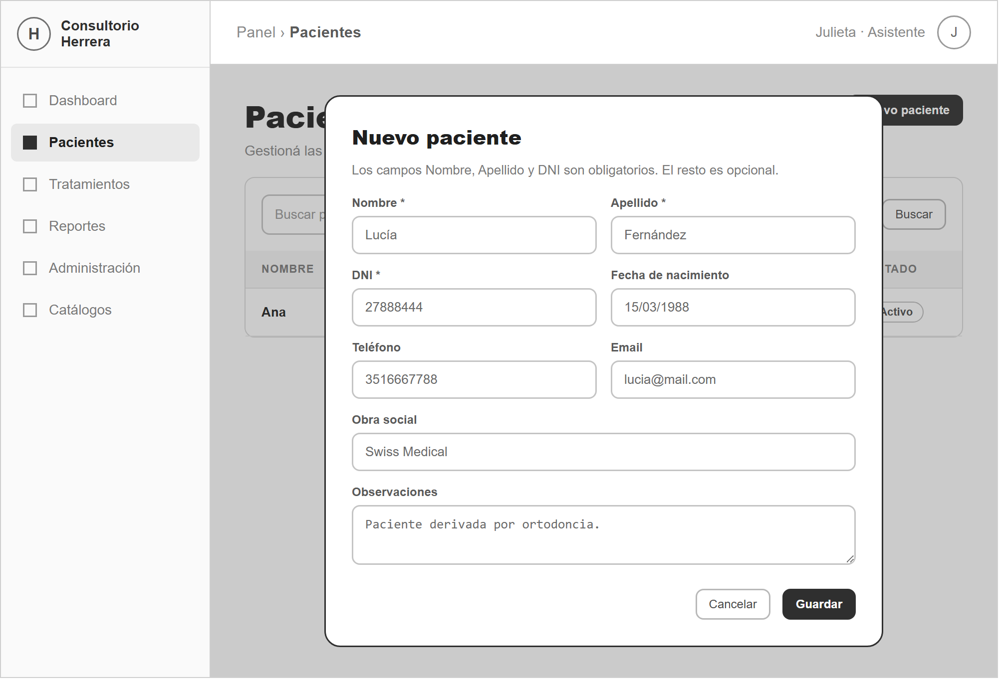
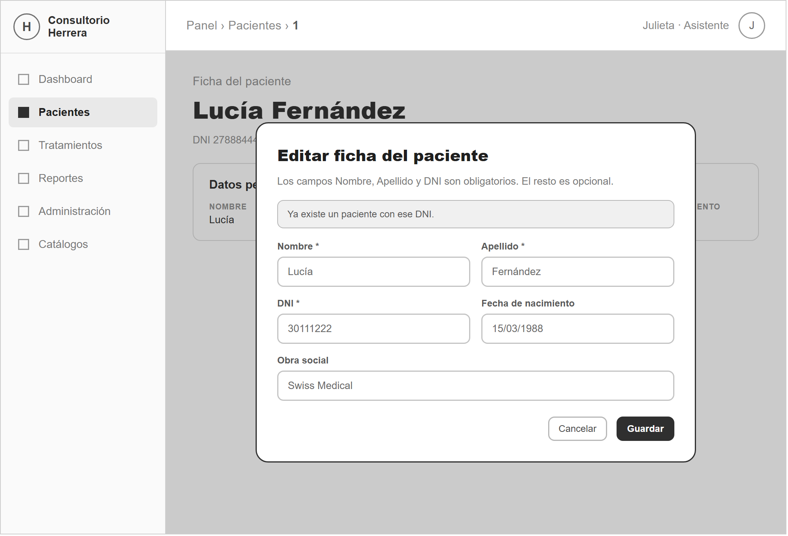
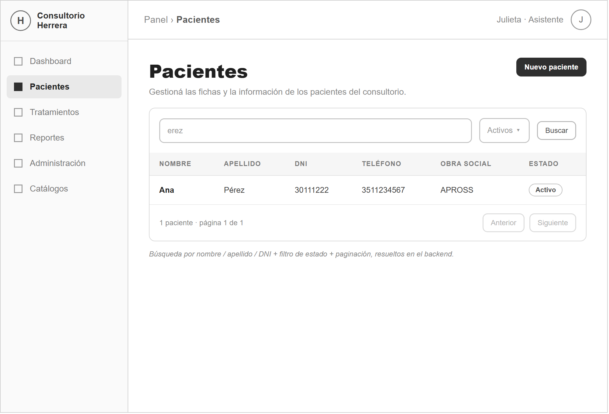
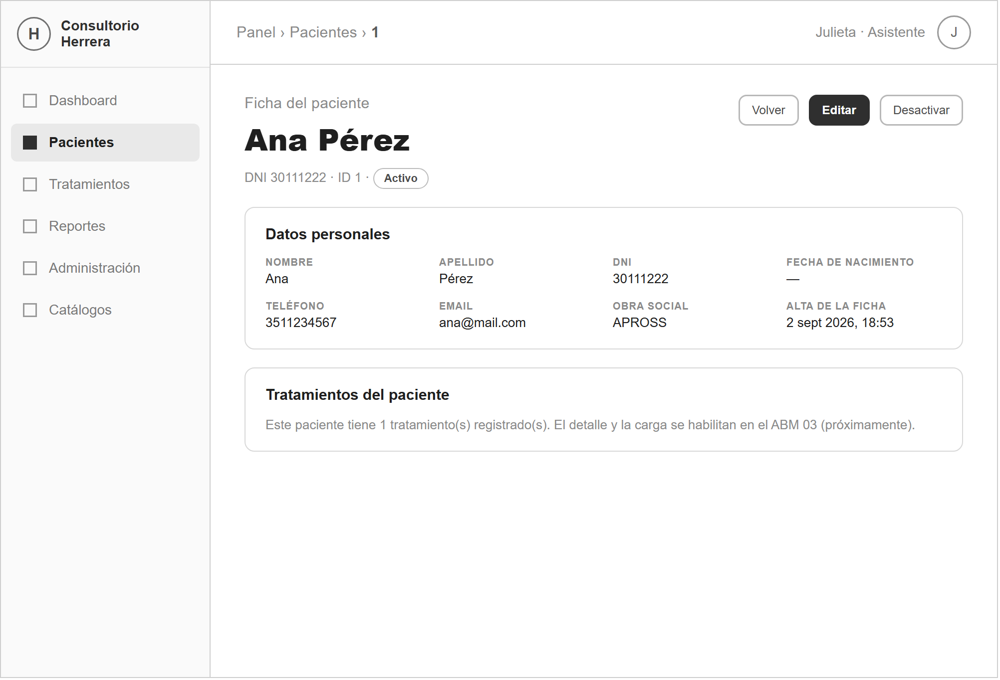
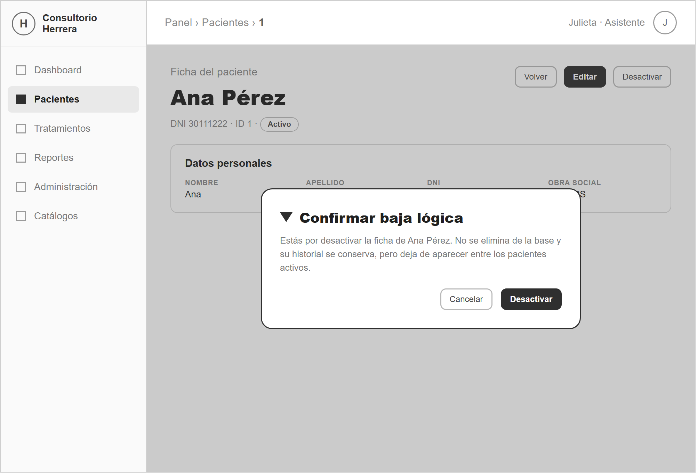
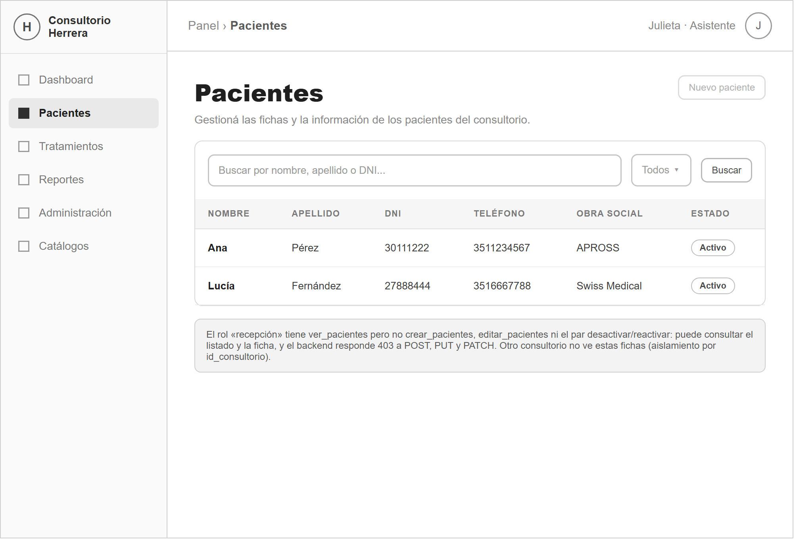

# SprintLog — ABM 02 · Pacientes

> Sprint documental: **3.2** · Historias: **HU-01 … HU-06** (numeración reiniciada por ABM).
> Documento formal: [`SprintLog-Pacientes.docx`](SprintLog-Pacientes.docx) (formato calcado de `docs/abm/modelo/com.docx`).
> Mockups: [`mockups/`](mockups/) (wireframes HTML + PNG en escala de grises, `generar-mockups.js`).
> Generación del `.docx`: `node generar-sprintlog.js` (usa `docx` / docx-js).

---

## Objetivo del Sprint

Implementar el ABM de **Pacientes**, la entidad **maestra central** del sistema del
consultorio odontológico Herrera. Toda la operación clínico-financiera de los
sprints siguientes (tratamientos → pagos → gastos) cuelga de un paciente, y la
ficha es el foco de la navegación.

La tabla `pacientes` ya existía con datos reales y con la columna `ACTIVO`, la
ruta `/panel/pacientes`, la página placeholder y los permisos `ver_pacientes` /
`crear_pacientes` / `editar_pacientes`. Este sprint agrega toda la
implementación (backend + frontend), el par de baja lógica
`desactivar_pacientes` / `reactivar_pacientes` y una migración **aditiva** que
suma `id_consultorio` (+ FK), `fecha_alta`, `id_usuario_alta` (+ FK) y
`fecha_nacimiento`, sin recrear ni renombrar nada.

A diferencia de un catálogo, Pacientes es una **entidad de negocio**: todas las
queries filtran por `req.usuario.id_consultorio` y cada alta estampa el
consultorio y el usuario autor. La **unicidad del DNI es por consultorio** y se
valida por aplicación (mayúsculas y espacios indiferentes).

---

## Sprint Backlog

| Nro | Historia de Usuario | Prioridad | Estimación | Dependencias |
|---|---|---|---|---|
| HU-01 | Como recepcionista del consultorio quiero dar de alta la ficha de un paciente con sus datos personales para poder registrarle tratamientos más adelante. | Alta | M | Ninguna |
| HU-02 | Como recepcionista del consultorio quiero modificar los datos de una ficha de paciente para mantener la información al día y corregir errores de carga. | Alta | S | HU-01 |
| HU-03 | Como usuario del sistema quiero consultar el listado de pacientes buscando por nombre, apellido o DNI, filtrando por estado y con paginación, para encontrar rápido la ficha que necesito. | Alta | M | HU-01 |
| HU-04 | Como usuario del sistema quiero abrir la ficha completa de un paciente, con todos sus datos y un resumen de sus tratamientos, para tener el panorama del paciente en una sola pantalla. | Alta | S | HU-01, HU-03 |
| HU-05 | Como administrador del consultorio quiero desactivar y reactivar la ficha de un paciente, conservando su historial, para sacar de circulación a los pacientes que ya no se atienden sin perder sus datos. | Alta | S | HU-01, HU-03 |
| HU-06 | Como administrador del consultorio quiero que cada acción sobre pacientes exija su permiso y que un consultorio no vea las fichas de otro, para que la información quede protegida y aislada. | Alta | S | HU-01 … HU-05 |

---

## HU-01 – Alta de paciente

**Como** recepcionista del consultorio
**quiero** dar de alta la ficha de un paciente cargando su nombre, apellido y DNI (obligatorios) y, opcionalmente, teléfono, email, obra social, fecha de nacimiento y observaciones,
**para** poder identificarlo y registrarle tratamientos más adelante.

### Criterios de aceptación

- **Criterio 1 — Alta correcta con ID visible.** Dado el formulario «Nuevo paciente» con los datos de Lucía Fernández (DNI 27888444); cuando se guarda; entonces HTTP 201, mensaje «Se creó la ficha de Lucía Fernández (ID 2).», la ficha aparece Activa en el listado y quedan estampados `id_consultorio`, `id_usuario_alta` y `fecha_alta`.
- **Criterio 2 — Validación por campo.** Dado un alta con nombre de 1 carácter, sin apellido, DNI `12x` y email mal formado; cuando se intenta guardar (cliente y backend); entonces HTTP 400 con `errores[]` y un mensaje por campo; no se crea la ficha.
- **Criterio 3 — DNI duplicado en el consultorio.** Dado que ya existe Ana Pérez con DNI 30111222; cuando se intenta crear otra ficha con DNI `30 111 222`; entonces HTTP 409 «Ya existe un paciente con ese DNI.» (comparación sin distinguir mayúsculas ni espacios).

*Figura 1 – Prototipo de la pantalla «Nuevo paciente» (HU-01)*

### Subtareas técnicas

| Subtarea | Descripción | Tamaño |
|---|---|---|
| `database/migrations/003_pacientes.sql` | `ALTER TABLE` aditivo: `id_consultorio` (+ FK), `fecha_alta`, `id_usuario_alta` (+ FK), `fecha_nacimiento`; backfill al consultorio 1. | S |
| `database/migrations/004_permisos_pacientes.sql` | Alta de `desactivar_pacientes` / `reactivar_pacientes` y asignación al rol administrador. | XS |
| `pacientes.service` — `crearPaciente` + helpers | Normalización, DNI único por consultorio (case/space-insensitive), INSERT que estampa consultorio y autor. | M |
| `pacientes.validator` — `validarDatosPaciente` | Middleware que arma `errores[]` por campo. | S |
| Ruta `POST /api/pacientes` | `verificarToken` + `verificarPermiso('crear_pacientes')`. | XS |
| Frontend — `FormularioPaciente.jsx` + alta en `PaginaPacientes.jsx` | Modal con validación de cliente espejo del backend. | M |
| Pruebas | Los 3 criterios vía API y en pantalla. | S |
| | **Total** | **M** |

---

## HU-02 – Modificación de la ficha del paciente

**Como** recepcionista del consultorio
**quiero** modificar los datos de una ficha de paciente existente,
**para** mantener la información al día y corregir errores de la carga inicial.

### Criterios de aceptación

- **Criterio 1 — Modificación reflejada.** Dado la ficha de Lucía Fernández en edición; cuando se cambia la obra social a «Swiss Medical» y se guarda; entonces HTTP 200, «La ficha se actualizó correctamente.» y el valor se ve en la ficha y en el listado.
- **Criterio 2 — Campos no editables.** Dado la edición de una ficha; entonces `ID_PACIENTE` y `fecha_alta` se muestran como sólo lectura y el backend nunca los modifica.
- **Criterio 3 — DNI que colisiona.** Dado la ficha de Lucía en edición; cuando se intenta poner el DNI 30111222 (el de Ana Pérez); entonces HTTP 409 «Ya existe un paciente con ese DNI.» y la ficha no se modifica (la unicidad excluye la propia ficha).

*Figura 2 – Prototipo de «Editar ficha del paciente» con el aviso de DNI duplicado (HU-02)*

### Subtareas técnicas

| Subtarea | Descripción | Tamaño |
|---|---|---|
| `pacientes.service` — `actualizarPaciente` | Existencia + pertenencia al consultorio (404), DNI único excluyendo la propia ficha, `UPDATE` de campos editables. | M |
| Ruta `PUT /api/pacientes/:id` | `verificarPermiso('editar_pacientes')`; valida id y cuerpo. | XS |
| Frontend — modo edición en `FichaPacientePage.jsx` | Reutiliza `FormularioPaciente.jsx` precargado; ID y fecha de alta fuera del formulario. | S |
| Manejo de errores por campo | El formulario muestra `errores[]` y el mensaje del 409. | XS |
| Pruebas | Edición normal, campos no editables, 409 por DNI en uso. | S |
| | **Total** | **S** |

---

## HU-03 – Consulta: listado con búsqueda, filtro y paginación

**Como** usuario del sistema
**quiero** consultar el listado de pacientes buscando por nombre, apellido o DNI, filtrando por estado y con paginación,
**para** encontrar rápidamente la ficha que necesito.

### Criterios de aceptación

- **Criterio 1 — Búsqueda y filtro.** Dado el listado; cuando se busca «erez» con estado «Activos»; entonces se muestra sólo a Ana Pérez con las columnas Nombre, Apellido, DNI, Teléfono, Obra social y Estado, y la paginación dice «1 paciente · página 1 de 1».
- **Criterio 2 — Sin resultados.** Dado que ningún paciente coincide con los filtros; entonces «No se encontraron pacientes con los filtros seleccionados.».
- **Criterio 3 — Paginación y parámetros.** Dado `?porPagina=1`; el backend devuelve `{ pacientes, total, pagina, porPagina }` y responde 400 si `porPagina > 100` o si `estado` no es un valor permitido.

*Figura 3 – Prototipo del listado de pacientes con búsqueda, filtro y paginación (HU-03)*

### Subtareas técnicas

| Subtarea | Descripción | Tamaño |
|---|---|---|
| `pacientes.service` — `listarPacientes` | `WHERE id_consultorio`, `LIKE` sobre nombre/apellido/DNI/nombre completo, filtro de estado, `ORDER BY apellido, nombre`, `LIMIT/OFFSET` + `COUNT`. | M |
| `pacientes.validator` — `validarFiltrosListado` | Valida `?estado`, `?pagina`, `?porPagina` (1–100). | S |
| Ruta `GET /api/pacientes` | `verificarPermiso('ver_pacientes')`. | XS |
| Frontend — `PaginaPacientes.jsx` | Búsqueda contra el backend, filtro de estado, paginación y fila clickeable → ficha. | M |
| Frontend — `pacientesService.js` + `pacientes.css` | Funciones axios (`respuesta.data`) y estilos que reutilizan `roles.css`. | S |
| Pruebas | Búsqueda, filtro, «sin resultados», paginación y parámetros inválidos. | S |
| | **Total** | **M** |

---

## HU-04 – Ver ficha del paciente

**Como** usuario del sistema
**quiero** abrir la ficha completa de un paciente, con todos sus datos personales y un resumen de sus tratamientos,
**para** tener el panorama del paciente en una sola pantalla.

### Criterios de aceptación

- **Criterio 1 — Ficha completa.** Dado el listado; cuando se hace clic en la fila de Ana Pérez; entonces se abre `/panel/pacientes/1` con el título «Ficha del paciente», todos los datos y `tratamientos_total` (1 tratamiento).
- **Criterio 2 — Paciente inexistente o de otro consultorio.** Dado una URL con un id que no existe o de otro consultorio; entonces HTTP 404 y la pantalla muestra «El paciente no existe o no pertenece a tu consultorio.» con botón para volver.
- **Criterio 3 — Sección de tratamientos como anticipo.** Dado la ficha; entonces la sección «Tratamientos del paciente» muestra el resumen y la leyenda de que el detalle se habilita en el ABM 03.

*Figura 4 – Prototipo de la pantalla «Ficha del paciente» (HU-04)*

### Subtareas técnicas

| Subtarea | Descripción | Tamaño |
|---|---|---|
| `pacientes.service` — `obtenerPacientePorId` | Ficha del consultorio (404 si no) + `tratamientos_total` con `COUNT` sobre `tratamientos`. | S |
| Ruta `GET /api/pacientes/:id` | `verificarPermiso('ver_pacientes')`; valida el id. | XS |
| Frontend — `FichaPacientePage.jsx` | Ruta `/panel/pacientes/:id`, datos en modo lectura, ID y fecha de alta bloqueados, placeholder del ABM 03. | M |
| Integración — `AppRouter.jsx` y `LayoutPrincipal.jsx` | Ruta `pacientes/:id` protegida por `ver_pacientes` y título «Ficha del paciente». | XS |
| Pruebas | Apertura desde el listado, 404, sección de tratamientos. | S |
| | **Total** | **S** |

---

## HU-05 – Baja lógica y reactivación de la ficha

**Como** administrador del consultorio
**quiero** desactivar la ficha de un paciente y poder reactivarla,
**para** sacar de circulación a los pacientes que ya no se atienden sin eliminar el registro ni perder su historial.

### Criterios de aceptación

- **Criterio 1 — Baja lógica con aviso de tratamientos.** Dado la ficha activa de Ana Pérez (1 tratamiento); cuando se la desactiva y se confirma; entonces pasa a Inactivo, se muestra «La ficha se desactivó correctamente.» + advertencia «El paciente tiene 1 tratamientos registrados.»; desaparece del filtro «Activos» y sigue en «Inactivos» / «Todos».
- **Criterio 2 — Reactivación.** Dado la ficha inactiva de Ana Pérez; cuando se la reactiva; entonces vuelve a Activo; si existiera otra ficha activa con el mismo DNI el sistema respondería 409.
- **Criterio 3 — Doble baja.** Dado una ficha ya inactiva; cuando se intenta desactivarla de nuevo; entonces HTTP 400 «El paciente ya se encuentra inactivo.».

*Figura 5 – Prototipo del modal «Confirmar baja lógica» en la ficha (HU-05)*

### Subtareas técnicas

| Subtarea | Descripción | Tamaño |
|---|---|---|
| `pacientes.service` — `desactivarPaciente` | Ficha del consultorio, rechazo de doble baja, `UPDATE activo = 0`, `advertencia` si `tratamientos_total > 0`. | S |
| `pacientes.service` — `reactivarPaciente` | Rechazo si ya está activa y si hay otra ficha activa con el mismo DNI (409); `UPDATE activo = 1`. | S |
| Rutas `PATCH /api/pacientes/:id/desactivar` y `/reactivar` | Protegidas con `desactivar_pacientes` y `reactivar_pacientes`. | XS |
| Frontend — modal de confirmación en la ficha | Reutiliza `ConfirmacionAccionModal.jsx` de `roles/`; muestra éxito y advertencia. | S |
| Pruebas | Baja con aviso, filtros por estado, reactivación, doble baja. | S |
| | **Total** | **S** |

---

## HU-06 – Acceso por permiso y aislamiento por consultorio

**Como** administrador del consultorio
**quiero** que cada acción sobre pacientes exija su permiso y que un consultorio no pueda ver ni tocar las fichas de otro,
**para** que la información de los pacientes quede protegida y aislada por consultorio.

### Criterios de aceptación

- **Criterio 1 — Sólo lectura sin permisos de escritura.** Dado un usuario con `ver_pacientes` pero sin `crear_pacientes` / `editar_pacientes` / `desactivar_pacientes` / `reactivar_pacientes`; cuando abre la pantalla; entonces ve listado y fichas, «Nuevo paciente» aparece deshabilitado, no hay «Editar» / «Desactivar» / «Reactivar», y el backend responde 403 a POST, PUT y PATCH.
- **Criterio 2 — Sin `ver_pacientes` no hay acceso.** Dado un usuario sin `ver_pacientes`; cuando intenta entrar a `/panel/pacientes` o llamar a `GET /api/pacientes`; entonces el panel lo deriva a «Acceso denegado» y la API responde 403 «No tenés permisos para realizar esta acción.».
- **Criterio 3 — Aislamiento por consultorio.** Dado una ficha de otro consultorio; cuando se intenta verla / editarla / desactivarla / reactivarla; entonces HTTP 404 «El paciente no existe o no pertenece a este consultorio.» (todas las queries filtran por `req.usuario.id_consultorio`).

*Figura 6 – Prototipo del listado de pacientes en modo de sólo lectura (HU-06)*

### Subtareas técnicas

| Subtarea | Descripción | Tamaño |
|---|---|---|
| Permisos en cada ruta | `verificarPermiso` con `ver` / `crear` / `editar` / `desactivar` / `reactivar_pacientes` según el método. | XS |
| Filtro por `id_consultorio` en el service | Todas las queries lo incluyen y todo INSERT lo estampa. | S |
| Frontend — botones según `tienePermiso` | `PaginaPacientes.jsx` y `FichaPacientePage.jsx` ocultan / deshabilitan acciones. | S |
| Integración — `AppRouter.jsx` | Rutas `pacientes` y `pacientes/:id` con `RutaPorPermiso permisoRequerido="ver_pacientes"`. | XS |
| Pruebas | 403 por método sin permiso, «Acceso denegado» sin `ver_pacientes`, 404 por consultorio ajeno. | S |
| | **Total** | **S** |

---

## Consideración para el Sprint siguiente: ABM de Tratamientos

El siguiente ABM es **Tratamientos**, la primera entidad **transaccional**: evento
de negocio con ciclo de estados (`pendiente → en proceso → finalizado` /
`cancelado`) que referencia `pacientes.ID_PACIENTE`, `tipos_tratamiento` y
`estados_tratamiento` (todos disponibles tras los ABM 01 y 02). Agrega
`id_consultorio` a `tratamientos`, crea la tabla genérica `auditoria_cambios` y
sigue la plantilla completa del material de ABM transaccional (matriz de
transiciones + pruebas con datos/pasos/resultado). Mismo formato de documentación.

---

## Checklist de aceptación (de `docs/abm/02-pacientes.md`)

- [x] Migraciones aplicadas; el paciente existente (Ana Pérez) conserva sus datos y queda `activo = 1`, `id_consultorio = 1`.
- [x] Alta con validación por campo (cliente + backend); DNI duplicado → 409 «Ya existe un paciente con ese DNI.», no crea.
- [x] Listado con búsqueda por nombre/apellido/DNI, filtro por estado y paginación server-side (`{ pacientes, total, pagina, porPagina }`).
- [x] Ficha muestra todos los campos; la edición persiste y se refleja en el listado.
- [x] Baja lógica: desaparece de «activos», visible en «todos»/«inactivos», reactivable; advertencia si el paciente tiene tratamientos.
- [x] Campos no editables bloqueados (`ID_PACIENTE`, `fecha_alta`).
- [x] Sin `crear_pacientes` no aparece el botón y el `POST` responde 403 (verificado con el rol de prueba 5).
- [x] `sprintlog.md` + `SprintLog-Pacientes.docx` generados.
- [x] Tabla de prueba manual de la API incluida (abajo).

---

## Tabla de prueba manual de la API

Base URL `http://localhost:3000/api`. Header `Authorization: Bearer <JWT>`.
`ADMIN` = rol administrador (tiene los 5 permisos de pacientes). `LECTOR` = sólo `ver_pacientes`.
`SINPERM` = sin `ver_pacientes`. El seed inicial es **Ana Pérez** (`id_paciente 1`, DNI `30111222`, 1 tratamiento).

| # | Método | Ruta | Auth | Body | Respuesta esperada | HTTP |
|--:|---|---|---|---|---|---|
| 1 | GET | `/pacientes` | — | — | `No se envió token de autenticación.` | 401 |
| 2 | GET | `/pacientes` | SINPERM | — | `No tenés permisos para realizar esta acción.` | 403 |
| 3 | GET | `/pacientes` | ADMIN | — | `{ ok:true, pacientes:[…], total:1, pagina:1, porPagina:20 }` | 200 |
| 4 | GET | `/pacientes?busqueda=erez&estado=activos` | ADMIN | — | sólo Ana Pérez; `total:1` | 200 |
| 5 | GET | `/pacientes?estado=raro` | ADMIN | — | `Los datos enviados no son válidos.` + `errores` | 400 |
| 6 | GET | `/pacientes?porPagina=500` | ADMIN | — | `errores:["La cantidad por página debe ser un entero entre 1 y 100."]` | 400 |
| 7 | GET | `/pacientes/1` | ADMIN | — | `{ ok:true, paciente:{ …, tratamientos_total:1 } }` | 200 |
| 8 | GET | `/pacientes/999` | ADMIN | — | `El paciente no existe o no pertenece a este consultorio.` | 404 |
| 9 | GET | `/pacientes/abc` | ADMIN | — | `El identificador del paciente no es válido.` | 400 |
| 10 | POST | `/pacientes` | ADMIN | `{ "nombre":"Lucía","apellido":"Fernández","dni":"27888444","email":"lucia@mail.com","obra_social":"OSDE","fecha_nacimiento":"1988-03-15" }` | `{ ok:true, paciente:{ id_paciente:2, activo:1, id_usuario_alta:<id> } }` | 201 |
| 11 | POST | `/pacientes` | ADMIN | `{ "nombre":"Ana","apellido":"Perez","dni":"30111222" }` | `Ya existe un paciente con ese DNI.` | 409 |
| 12 | POST | `/pacientes` | ADMIN | `{ "nombre":"A","apellido":"","dni":"12x","email":"malito","fecha_nacimiento":"2099-01-01" }` | `errores:[ nombre, apellido, DNI, email, fecha futura ]` | 400 |
| 13 | POST | `/pacientes` | LECTOR | `{ "nombre":"X","apellido":"Y","dni":"12345678" }` | `No tenés permisos para realizar esta acción.` | 403 |
| 14 | PUT | `/pacientes/2` | ADMIN | `{ "nombre":"Lucía","apellido":"Fernández","dni":"27888444","obra_social":"Swiss Medical" }` | `{ ok:true, paciente:{ obra_social:"Swiss Medical" } }` | 200 |
| 15 | PUT | `/pacientes/2` | ADMIN | `{ "nombre":"Lucía","apellido":"Fernández","dni":"30111222" }` | `Ya existe un paciente con ese DNI.` | 409 |
| 16 | PATCH | `/pacientes/1/desactivar` | ADMIN | — | `{ ok:true, paciente:{ activo:0 }, advertencia:"El paciente tiene 1 tratamientos registrados." }` | 200 |
| 17 | PATCH | `/pacientes/1/desactivar` | ADMIN | — | `El paciente ya se encuentra inactivo.` | 400 |
| 18 | GET | `/pacientes?estado=inactivos` | ADMIN | — | incluye a Ana Pérez con `activo:0` | 200 |
| 19 | PATCH | `/pacientes/1/reactivar` | ADMIN | — | `{ ok:true, paciente:{ activo:1 } }` | 200 |
| 20 | PATCH | `/pacientes/1/desactivar` | LECTOR | — | `No tenés permisos para realizar esta acción.` | 403 |

> Filas 10/14 crean/dejan datos de prueba (`Lucía Fernández`). Para dejar la base como el seed:
> `DELETE FROM pacientes WHERE id_paciente > 1;` · `ALTER TABLE pacientes AUTO_INCREMENT = 2;`
